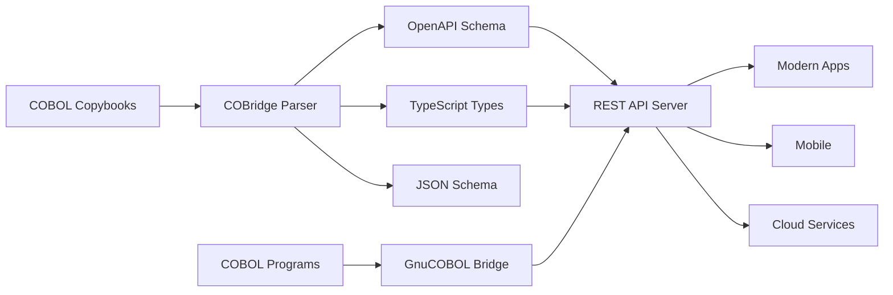

<div align="center">

```
   _____ ____  ____       _     _
  / ____/ __ \|  _ \     (_)   | |
 | |   | |  | | |_) |_ __ _  __| | __ _  ___
 | |   | |  | |  _ <| '__| |/ _` |/ _` |/ _ \
 | |___| |__| | |_) | |  | | (_| | (_| |  __/
  \_____\____/|____/|_|  |_|\__,_|\__, |\___|
                                   __/ |
                                  |___/
```

### **Don't rewrite your COBOL. Bridge it.**

*Auto-generate REST APIs from COBOL copybooks — zero changes to your COBOL programs.*

[](LICENSE)
[](https://www.npmjs.com/package/cobridge)
[]()
[]()
[]()
[]()
[](CONTRIBUTING.md)

---

</div>

## The Problem

```
┌─────────────────┐  ┌─────────────────┐  ┌─────────────────┐  ┌─────────────────┐
│  £2.4 TRILLION   │  │      95%         │  │     45/50       │  │      71%        │
│  daily commerce  │  │ ATM transactions │  │   top banks     │  │  teams under-   │
│  runs on COBOL   │  │ powered by COBOL │  │ use mainframes  │  │    staffed      │
└─────────────────┘  └─────────────────┘  └─────────────────┘  └─────────────────┘
```

COBOL isn't the problem. It processes **£2.4 trillion** in daily commerce, handles **95%** of ATM transactions, and runs core systems at **45 of the top 50** banks. It's fast, battle-tested, and reliable.

**The real problem is the ecosystem around it.** Modern apps need REST APIs, JSON, and TypeScript types. Every attempt to rewrite COBOL into Java or Python degrades performance, introduces risk, and costs hundreds of millions of pounds.

**COBridge takes a different approach**: keep your COBOL running exactly as-is. Bridge it to the modern world.

---

## The Solution

COBridge reads your COBOL copybooks, understands the record layouts, and auto-generates everything modern applications need to talk to your COBOL programs — OpenAPI specs, TypeScript types, JSON schemas, and a ready-to-deploy REST API server.

No vendor lock-in. No mainframe required. Runs anywhere Node.js runs.



---

## Documentation

Full documentation is available in the [`docs/`](docs/) directory:

| Guide | Description |
|:------|:------------|
| [Getting Started](docs/getting-started.md) | From zero to running API in 5 minutes |
| [Copybook Parser](docs/copybook-parser.md) | All supported COBOL syntax with examples |
| [Code Generation](docs/code-generation.md) | OpenAPI, TypeScript, and JSON Schema output |
| [Data Marshalling](docs/data-marshalling.md) | EBCDIC, COMP-3, and binary data conversion |
| [GnuCOBOL Bridge](docs/gnucobol-bridge.md) | Compiling and calling COBOL from Node.js |
| [REST API Server](docs/rest-api-server.md) | Auto-generated HTTP endpoints and middleware |
| [CLI Reference](docs/cli-reference.md) | Every command, flag, and option |
| [API Reference](docs/api-reference.md) | Programmatic API for library usage |
| [FAQ & Troubleshooting](docs/faq.md) | Common questions and solutions |
| [Migration Guide](docs/migration-guide.md) | Moving from z/OS Connect or OpenLegacy |
| [Contributing](CONTRIBUTING.md) | How to contribute to COBridge |

---

## Quick Start

```bash
# Install globally
npm install -g cobridge

# Scaffold a new project
cobridge init my-project

# Parse a copybook and inspect the AST
cobridge parse ./copybooks/customer.cpy

# Generate OpenAPI spec + TypeScript types
cobridge generate ./copybooks/customer.cpy --format both

# Start the REST API server
cobridge serve ./my-project --port 3000
```

---

## How It Works

### 1. You have a COBOL copybook

This is a real record layout that defines a customer in a banking system:

```cobol
       01  CUSTOMER-RECORD.
           05  CUST-ID                    PIC 9(10).
           05  CUST-PERSONAL-INFO.
               10  CUST-FIRST-NAME       PIC X(30).
               10  CUST-LAST-NAME        PIC X(30).
               10  CUST-DATE-OF-BIRTH.
                   15  CUST-DOB-YEAR     PIC 9(4).
                   15  CUST-DOB-MONTH    PIC 9(2).
                   15  CUST-DOB-DAY      PIC 9(2).
               10  CUST-SSN              PIC X(11).
           05  CUST-ACCOUNT-SUMMARY.
               10  CUST-NUM-ACCOUNTS     PIC 9(3) COMP-3.
               10  CUST-TOTAL-BALANCE    PIC S9(13)V99 COMP-3.
               10  CUST-CREDIT-SCORE     PIC 9(3).
           05  CUST-STATUS               PIC X(1).
```

### 2. COBridge parses it into a typed AST

The parser tokenizes the copybook, resolves level-number hierarchy, expands PIC shorthand, calculates byte lengths for every USAGE type, and computes field offsets:

```bash
cobridge parse ./copybooks/customer.cpy
```

```json
{
  "name": "CUSTOMER-RECORD",
  "totalLength": 227,
  "fields": [
    {
      "levelNumber": 1,
      "name": "CUSTOMER-RECORD",
      "isGroup": true,
      "byteLength": 227,
      "startOffset": 0,
      "children": [
        {
          "name": "CUST-ID",
          "picture": { "type": "numeric", "length": 10, "decimals": 0 },
          "byteLength": 10,
          "startOffset": 0
        },
        {
          "name": "CUST-PERSONAL-INFO",
          "isGroup": true,
          "byteLength": 109,
          "startOffset": 10,
          "children": [ "..." ]
        }
      ]
    }
  ]
}
```

### 3. Auto-generates an OpenAPI spec

```bash
cobridge generate ./copybooks/customer.cpy --format openapi
```

```yaml
openapi: 3.0.3
info:
  title: CUSTOMER-RECORD API
  version: 1.0.0
  description: Auto-generated from COBOL copybook by COBridge
paths:
  /customer-record:
    post:
      summary: Submit a CUSTOMER-RECORD
      requestBody:
        content:
          application/json:
            schema:
              $ref: '#/components/schemas/CustomerRecord'
components:
  schemas:
    CustomerRecord:
      type: object
      properties:
        custId:
          type: integer
          description: "PIC 9(10)"
        custPersonalInfo:
          type: object
          properties:
            custFirstName:
              type: string
              maxLength: 30
            custLastName:
              type: string
              maxLength: 30
```

### 4. Auto-generates TypeScript types

```bash
cobridge generate ./copybooks/customer.cpy --format typescript
```

```typescript
/** Auto-generated by COBridge from CUSTOMER-RECORD copybook */

export interface CustomerRecord {
  custId: number;
  custPersonalInfo: {
    custFirstName: string;
    custLastName: string;
    custDateOfBirth: {
      custDobYear: number;
      custDobMonth: number;
      custDobDay: number;
    };
    custSsn: string;
  };
  custAccountSummary: {
    custNumAccounts: number;
    custTotalBalance: number;
    custCreditScore: number;
  };
  custStatus: string;
}
```

### 5. Serves it as a REST API

```bash
cobridge serve ./my-project --port 3000
```

```bash
curl -X POST http://localhost:3000/customer-record \
  -H "Content-Type: application/json" \
  -d '{
    "custId": 1234567890,
    "custPersonalInfo": {
      "custFirstName": "Jane",
      "custLastName": "Doe"
    }
  }'
```

COBridge marshals the JSON into a COBOL-format binary buffer, calls the compiled COBOL program via GnuCOBOL, and returns the result as JSON. Your COBOL program never knows it's talking to a web server.

---

## Feature Comparison

| Feature | COBridge | IBM z/OS Connect | OpenLegacy |
|:--------|:--------:|:-----------------:|:----------:|
| Open Source | **Yes** | No | No |
| Free | **Yes** | $$$ | $$$ |
| GnuCOBOL Support | **Yes** | No | No |
| Runs on Linux / Cloud | **Yes** | z/OS only | Partial |
| Auto-gen OpenAPI | **Yes** | Yes | Yes |
| Auto-gen TypeScript | **Yes** | No | No |
| Data Marshalling | **Yes** | Yes | Yes |
| No Vendor Lock-in | **Yes** | No | No |

---

## Supported COBOL Features

### Parser

| Feature | Status | Details |
|:--------|:------:|:--------|
| PIC X (alphanumeric) | Supported | `PIC X(30)`, `PIC XXX`, `PIC A(10)` |
| PIC 9 (numeric) | Supported | `PIC 9(5)`, `PIC 9(5)V9(2)`, `PIC S9(7)` |
| COMP / BINARY | Supported | 2, 4, or 8 bytes based on digit count |
| COMP-1 | Supported | Single-precision float (4 bytes) |
| COMP-2 | Supported | Double-precision float (8 bytes) |
| COMP-3 / PACKED-DECIMAL | Supported | Packed BCD encoding |
| OCCURS | Supported | Fixed-length arrays, `OCCURS n TIMES` |
| OCCURS DEPENDING ON | Supported | Variable-length arrays |
| REDEFINES | Supported | Overlapping storage / union types |
| Group items | Supported | Nested structures via level numbers |
| FILLER | Supported | Unnamed padding fields |
| Level 88 conditions | Supported | Parsed and skipped for layout |
| Level 66 RENAMES | Planned | |
| COPY / REPLACE | Planned | |

### Data Marshalling

| Encoding | Direction | Details |
|:---------|:---------:|:--------|
| EBCDIC (Code Page 037) | Encode / Decode | Full US/Canada code page |
| EBCDIC (Code Page 500) | Encode / Decode | International / Latin-1 |
| Packed Decimal (COMP-3) | Encode / Decode | Signed and unsigned |
| Binary (COMP / BINARY) | Encode / Decode | Big-endian, 2/4/8 byte |
| COMP-1 (Float) | Encode / Decode | IEEE 754 single precision |
| COMP-2 (Double) | Encode / Decode | IEEE 754 double precision |
| Display Numeric | Encode / Decode | Zone decimal with sign handling |

### GnuCOBOL Bridge

| Feature | Status | Details |
|:--------|:------:|:--------|
| Compiler detection | Supported | Auto-detects `cobc` installation and version |
| Module compilation | Supported | Compiles `.cbl` to `.so` / `.dll` via `cobc -m` |
| Executable compilation | Supported | Compiles to standalone binary via `cobc -x` |
| Program invocation | Supported | Calls compiled programs via `cobcrun` with stdin/stdout data exchange |
| Timeout control | Supported | Configurable per-call timeout (default 30s) |

---

## Battle Tested

COBridge has been stress-tested against **25 real-world copybooks** spanning banking, insurance, payments, and adversarial edge cases — with **177 tests passing and zero failures**.

```
┌──────────────────────────────────────────────────────────────────────┐
│                        TEST RESULTS                                  │
├──────────────┬───────────┬───────────┬───────────┬──────────────────┤
│  Parser      │  Marshal  │  Codegen  │  Stress   │  TOTAL           │
│  41/41       │  40/40    │  74/74    │  22/22    │  177/177         │
│  passed      │  passed   │  passed   │  passed   │  ALL PASSED      │
└──────────────┴───────────┴───────────┴───────────┴──────────────────┘
```

### Stress Test Copybooks

Every copybook below was parsed, converted to OpenAPI + TypeScript, and round-trip marshalled (JSON → COBOL buffer → JSON) with zero errors:

#### Banking & Finance

| Copybook | Fields | Bytes | Description |
|:---------|-------:|------:|:------------|
| `insurance-claim.cpy` | 51 | 849 | Insurance claim with COMP-3 money fields, payment history array |
| `mortgage-record.cpy` | 57 | 682 | Mortgage with `9V9(4)` interest rates, 12-month amortisation OCCURS |
| `payroll-record.cpy` | 52 | 346 | Employee payroll with 16 deduction types, YTD accumulators |
| `wire-transfer.cpy` | 53 | 848 | SWIFT wire transfer with BIC codes, compliance screening fields |
| `credit-card-txn.cpy` | 39 | 242 | Card transaction with merchant info, authorisation, settlement |
| `loan-application.cpy` | 47 | 1,017 | Loan application with OCCURS 4 applicants, credit check results |
| `stock-trade.cpy` | 44 | 447 | Stock trade with bid/ask `S9(7)V9(4)` prices, allocation arrays |
| `ach-batch.cpy` | 40 | 4,782 | ACH batch with OCCURS 50 detail records |
| `iso8583.cpy` | 51 | 678 | ISO 8583 payment message format (card payments worldwide) |
| `swift-mt103.cpy` | 65 | 890 | SWIFT MT103 single customer credit transfer |

#### Parser Edge Cases

| Copybook | Fields | Bytes | What it tests |
|:---------|-------:|------:|:--------------|
| `deeply-nested.cpy` | 23 | 114 | 7 levels deep (01→05→10→15→20→25→30→35) |
| `many-occurs.cpy` | 25 | 11,684 | Nested OCCURS (5 × 20 × 5), OCCURS DEPENDING ON |
| `redefines-chain.cpy` | 25 | 91 | Chained REDEFINES: A, B REDEFINES A, C REDEFINES A |
| `all-pic-types.cpy` | 29 | 197 | Every PIC type: X, A, 9, S9, Z, *, B, CR, DB, +, -, 0, / |
| `large-record.cpy` | 78 | 1,811 | Census record — 78 fields, OCCURS 10 persons |
| `filler-heavy.cpy` | 29 | 297 | 15 FILLER fields for byte-level padding |
| `comp-5.cpy` | 23 | 130 | All COMP variants: COMP, BINARY, COMP-1, COMP-2, COMP-3 |
| `sign-variations.cpy` | 18 | 86 | Signed, unsigned, COMP-3, COMP in all combinations |
| `mixed-format.cpy` | 23 | 195 | Level 77 standalone items, level 88 conditions, multiple 01-levels |
| `pic-shorthand.cpy` | 18 | 70 | PIC without parentheses: `PIC XXXXX`, `PIC S999V99` |
| `value-clauses.cpy` | 18 | 135 | VALUE SPACES, VALUE ZEROS, VALUE 'OK', VALUE ALL '*' |
| `blank-when-zero.cpy` | 19 | 143 | Zero-suppressed Z-fields, slash-edited date formats |

### Performance

```
Average parse time:     0.22ms per copybook
Average codegen time:   0.19ms per copybook
Average marshal time:   0.62ms per copybook
```

### Bugs Found During Stress Testing

| Bug | Severity | Status |
|:----|:--------:|:------:|
| REDEFINES fields marshalled at wrong offset (sequential instead of overlapping) | High | **Fixed** |

The REDEFINES bug was discovered by the `redefines-chain.cpy` stress test. Fields that share overlapping storage via `REDEFINES` were being written sequentially, overrunning the buffer. Fixed with proper sibling offset tracking. All 155 pre-existing tests confirmed zero regressions.

---

## Architecture

```
cobridge/
├── src/
│   ├── parser/          # Copybook lexer, parser, and AST types
│   │   ├── lexer.ts     # Tokenizer — COBOL keywords, PIC strings, level numbers
│   │   ├── parser.ts    # Recursive descent parser — builds typed AST
│   │   └── types.ts     # CopybookField, PicInfo, UsageType, OccursClause
│   ├── marshal/         # Binary data marshalling
│   │   ├── ebcdic.ts    # ASCII <-> EBCDIC conversion (CP037, CP500)
│   │   ├── packed-decimal.ts  # COMP-3 pack / unpack
│   │   ├── binary.ts    # COMP / BINARY / COMP-1 / COMP-2 encoding
│   │   └── converter.ts # High-level JSON <-> COBOL buffer marshaller
│   ├── bridge/          # GnuCOBOL integration
│   │   ├── gnucobol.ts  # Compile and call COBOL programs
│   │   └── process.ts   # Process lifecycle management
│   ├── cli/             # Command-line interface (Commander.js)
│   └── index.ts         # Public API re-exports
├── examples/
│   ├── copybooks/       # Sample .cpy files (customer, transaction)
│   └── programs/        # Sample .cbl programs (customer-lookup)
└── tests/               # Parser, marshal, and codegen test suites
```

---

## Roadmap

- [x] Copybook parser with full PIC clause support
- [x] TypeScript type generation
- [x] OpenAPI spec generation
- [x] CLI tool (`parse`, `generate`, `serve`, `init`)
- [x] Express HTTP server
- [x] Data marshalling (EBCDIC, COMP-3, BINARY, COMP-1/2)
- [x] GnuCOBOL bridge (compile + call)
- [ ] Dashboard UI (React + TailAdmin)
- [ ] CICS compatibility layer
- [ ] Batch job orchestration
- [ ] VS Code extension
- [ ] Docker image
- [ ] Swagger UI integration
- [ ] Performance benchmarking suite

---

## Why Not Just Rewrite?

| | Rewrite | COBridge |
|:--|:--------|:---------|
| **Cost** | £40M - £400M | £0 |
| **Timeline** | 3 - 5 years | Days |
| **Risk** | High (60%+ fail) | Near zero |
| **COBOL changes** | Replace everything | None |
| **Performance** | Often worse | Unchanged |
| **Institutional knowledge** | Lost | Preserved |

The Commonwealth Bank of Australia spent **£600 million** over 5 years replacing their COBOL core. Most organisations don't have that budget or that risk tolerance.

COBridge lets you keep the COBOL that works and wrap it with the interfaces modern teams expect. No rewrite. No risk. No cost.

---

## Contributing

Contributions are welcome. Whether it's a bug fix, a new feature, or documentation improvement — we'd love your help.

See **[CONTRIBUTING.md](CONTRIBUTING.md)** for the full guide, including development setup, code style, and pull request process.

Quick version:

1. Fork the repository
2. Create your feature branch (`git checkout -b feature/amazing-feature`)
3. Run the tests (`npm test` — all 177 must pass)
4. Commit your changes (`git commit -m 'Add amazing feature'`)
5. Open a Pull Request

See the [open issues](../../issues) for areas where help is needed.

---

## License

Distributed under the **MIT License**. See [LICENSE](LICENSE) for details.

---

<div align="center">

Built with care for the **240+ billion lines of COBOL** still running the world's economy.

**[Getting Started](#quick-start)** &nbsp;&middot;&nbsp; **[Documentation](#how-it-works)** &nbsp;&middot;&nbsp; **[Report Bug](../../issues)** &nbsp;&middot;&nbsp; **[Request Feature](../../issues)**

</div>
